# Tips-of-Feature-engineering

A feature engineering kit for each issue, to give you a deeper and deeper understanding of the work of feature engineering!

> 每一期都会分享一些很实用的特征工程技巧，目前这里存放了历史的所有期数，最新的期数欢迎关注微信公众号哦（SAMshare）！


随着我们在机器学习、数据建模、数据挖掘分析这条发展路上越走越远，其实越会感觉到特征工程的重要性，平时我们在很多地方都会看到一些很好的特征工程技巧，本项目的目的就是把这些小技巧打包成一个又一个的小锦囊，供大家去阅读。

首先是当前更新到的目录，方便大家去查找内容！


## 🚗 持续更新

- [Tip1：特征无量纲化的常见操作方法](#Tip1：特征无量纲化的常见操作方法)
* [Tip2：怎么进行多项式or对数的数据变换](#Tip2：怎么进行多项式or对数的数据变换)
* [Tip3：常用的统计图在Python里怎么画?](#Tip3：常用的统计图在Python里怎么画?)
* [Tip4：怎么去除DataFrame里的缺失值？](#Tip4：怎么去除DataFrame里的缺失值？)
* [Tip5：怎么把被错误填充的缺失值还原？](#Tip5：怎么把被错误填充的缺失值还原？)
* [Tip6：怎么定义一个方法去填充分类变量的空值？](#Tip6：怎么定义一个方法去填充分类变量的空值？)
* [Tip7：怎么定义一个方法去填充数值变量的空值？](#Tip7：怎么定义一个方法去填充数值变量的空值？)
* [Tip8：怎么把几个图表一起在同一张图上显示？](#Tip8：怎么把几个图表一起在同一张图上显示？)
* [Tip9：怎么把画出堆积图来看占比关系？](#Tip9：怎么把画出堆积图来看占比关系？)
* [Tip10：怎么对满足某种条件的变量修改其变量值？](#Tip10：怎么对满足某种条件的变量修改其变量值？)
* [Tip11：怎么通过正则提取字符串里的指定内容?](#Tip11：怎么通过正则提取字符串里的指定内容?)
* [Tip12：如何利用字典批量修改变量值？](#Tip12：如何利用字典批量修改变量值？)
* [Tip13：如何对类别变量进行独热编码？](#Tip13：如何对类别变量进行独热编码？)
* [Tip14：如何把“年龄”字段按照我们的阈值分段？](#Tip14：如何把"年龄"字段按照我们的阈值分段？)
* [Tip15：如何使用sklearn的多项式来衍生更多的变量？](#Tip15：如何使用sklearn的多项式来衍生更多的变量？)
* [Tip16：如何根据变量相关性画出热力图？](#Tip16：如何根据变量相关性画出热力图？)
* [Tip17：如何把分布修正为类正态分布？](#Tip17：如何把分布修正为类正态分布？)
* [Tip18：怎么找出数据集中有数据倾斜的特征？](#tip18：怎么找出数据集中有数据倾斜的特征？)
- [Tip19：怎么尽可能地修正数据倾斜的特征？](#tip19：怎么尽可能地修正数据倾斜的特征？)


## Tip1：特征无量纲化的常见操作方法

第一招，从简单的特征量纲处理开始，这里介绍了3种无量纲化操作的方法，同时也附上相关的包以及调用方法，欢迎补充！

> 无量纲化：即nondimensionalize 或者dimensionless，是指通过一个合适的变量替代，将一个涉及物理量的方程的部分或全部的单位移除，以求简化实验或者计算的目的。——百度百科


进行进一步解释，比如有两个字段，一个是车行走的公里数，另一个是人跑步的距离，他们之间的单位其实差异还是挺大的，其实两者之间无法进行比较的，但是我们可以进行去量纲，把他们的变量值进行缩放，都统一到某一个区间内，比如0-1，便于不同单位或者量级之间的指标可以进行比较or加权！

下面的是sklearn里的一些无量纲化的常见操作方法。

```python
from sklearn.datasets import load_iris  
#导入IRIS数据集  
iris = load_iris()

#标准化，返回值为标准化后的数据  
from sklearn.preprocessing import StandardScaler  
StandardScaler().fit_transform(iris.data)  

#区间缩放，返回值为缩放到[0, 1]区间的数据  
from sklearn.preprocessing import MinMaxScaler  
MinMaxScaler().fit_transform(iris.data)  

#归一化，返回值为归一化后的数据
from sklearn.preprocessing import Normalizer  
Normalizer().fit_transform(iris.data)
```


## Tip2：怎么进行多项式or对数的数据变换?

数据变换，这个操作在特征工程中用得还是蛮多的，一个特征在当前的分布下无法有明显的区分度，但一个小小的变换则可以带来意想不到的效果，而这个小小的变换，也就是今天给大家分享的小锦囊。

#### 多项式变换

按照指定的degree，进行多项式操作从而衍生出新变量(当然这是针对每一列特征内的操作)。

举个栗子：

```python
from sklearn.datasets import load_iris  
#导入IRIS数据集  
iris = load_iris()
iris.data[0]

# Output: array([ 5.1,  3.5,  1.4,  0.2])
```

```python
tt = PolynomialFeatures().fit_transform(iris.data)  
tt[0]

# Output: array([  1.  ,   5.1 ,   3.5 ,   1.4 ,   0.2 ,  26.01,  17.85,   7.14, 1.02,  12.25,   4.9 ,   0.7 ,   1.96,   0.28,   0.04])
```

因为PolynomialFeatures()方法默认degree是2，所以只会进行二项式的衍生。

一般来说，多项式变换都是按照下面的方式来的：

f = kx + b   一次函数（degree为1）

f = ax^2 + b*x + w  二次函数（degree为2）

f = a*x^3 + b*x^2 + c*x + w  三次函数（degree为3）


这类的转换可以适当地提升模型的拟合能力，对于在线性回归模型上的应用较为广泛。


#### 对数变换

这个操作就是直接进行一个对数转换，改变原先的数据分布，而可以达到的作用主要有:

1）取完对数之后可以缩小数据的绝对数值，方便计算；

2）取完对数之后可以把乘法计算转换为加法计算；

3）还有就是分布改变带来的意想不到的效果。


numpy库里就有好几类对数转换的方法，可以通过from numpy import xxx 进行导入使用。

log：计算自然对数

log10：底为10的log

log2：底为2的log

log1p：底为e的log


#### 代码集合

```python
from sklearn.datasets import load_iris  
#导入IRIS数据集  
iris = load_iris()

#多项式转换  
#参数degree为度，默认值为2 
from sklearn.preprocessing import PolynomialFeatures  
PolynomialFeatures().fit_transform(iris.data)  

#对数变换
from numpy import log1p  
from sklearn.preprocessing import FunctionTransformer  
#自定义转换函数为对数函数的数据变换  
#第一个参数是单变元函数  
FunctionTransformer(log1p).fit_transform(iris.data)  
```


## Tip3：常用的统计图在Python里怎么画?

这里的话我们介绍几种很简单但也很实用的统计图绘制方法，分别有条形图、饼图、箱体图、直方图以及散点图，关于这几种图形的含义这边就不多做解释了。

今天用到两个数据集，数据集大家可以在公众号回复"特征工程"来获取，分别是**Salary_Ranges_by_Job_Classification和GlobalLandTemperaturesByCity**。

#### 效果图：

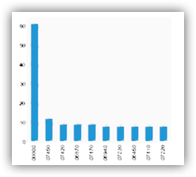

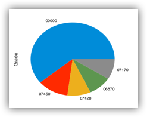

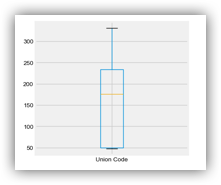

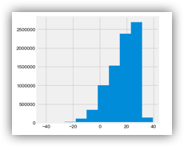

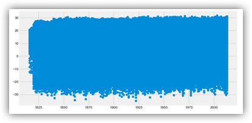


#### 代码集合

```python
# 导入一些常用包
import pandas as pd
import numpy as np
import matplotlib.pyplot as plt
import seaborn as sns

%matplotlib inline
plt.style.use('fivethirtyeight')

#解决中文显示问题，Mac
%matplotlib inline
from matplotlib.font_manager import FontProperties


# 引入第 1 个数据集 Salary_Ranges_by_Job_Classification
salary_ranges = pd.read_csv('./data/Salary_Ranges_by_Job_Classification.csv')

# 引入第 2 个数据集 GlobalLandTemperaturesByCity
climate = pd.read_csv('./data/GlobalLandTemperaturesByCity.csv')
# 移除缺失值
climate.dropna(axis=0, inplace=True)
# 只看中国
# 日期转换, 将dt 转换为日期，取年份, 注意map的用法
climate['dt'] = pd.to_datetime(climate['dt'])
climate['year'] = climate['dt'].map(lambda value: value.year)
climate_sub_china = climate.loc[climate['Country'] == 'China']
climate_sub_china['Century'] = climate_sub_china['year'].map(lambda x:int(x/100 +1))

# 设置显示的尺寸
plt.rcParams['figure.figsize'] = (4.0, 4.0) # 设置figure_size尺寸
plt.rcParams['image.interpolation'] = 'nearest' # 设置 interpolation style
plt.rcParams['image.cmap'] = 'gray' # 设置 颜色 style
plt.rcParams['savefig.dpi'] = 100 #图片像素
plt.rcParams['figure.dpi'] = 100 #分辨率
plt.rcParams['font.family'] = ['Arial Unicode MS'] #正常显示中文

# 绘制条形图
salary_ranges['Grade'].value_counts().sort_values(ascending=False).head(10).plot(kind='bar')
# 绘制饼图
salary_ranges['Grade'].value_counts().sort_values(ascending=False).head(5).plot(kind='pie')
# 绘制箱体图
salary_ranges['Union Code'].value_counts().sort_values(ascending=False).head(5).plot(kind='box')
# 绘制直方图
climate['AverageTemperature'].hist()
# 绘制散点图
x = climate_sub_china['year']
y = climate_sub_china['AverageTemperature']
fig, ax = plt.subplots(figsize=(10,5))
ax.scatter(x, y)
plt.show()
```


## Tip4：怎么去除DataFrame里的缺失值？

这个我们经常会用，当我们发现某个变量的缺失率太高的时候，我们会直接对其进行删除操作，又或者说某一行我不想要了，想单独删除这一行数据，这个我们该怎么处理呢？这里介绍一个方法，DataFrame.dropna()，具体可以看下图：

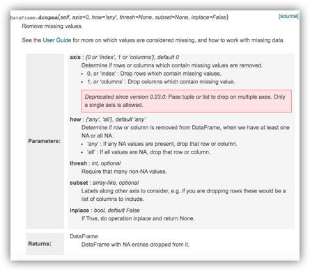

从方法介绍可以看出，我们可以指定 `axis` 的值，如果是0，那就是按照行去进行空值删除，如果是1则是按照列去进行操作，默认是0。

同时，还有一个参数是`how` ,就是选择删除的条件，如果是 `any`则是如果存在一个空值，则这行(列)的数据都会被删除，如果是 `all`的话，只有当这行(列)全部的变量值为空才会被删除，默认的话都是`any` 。

好了，举几个栗子，我们还是用climate数据集：

```python
# 引入数据集
import pandas as pd
climate = pd.read_csv('./data/GlobalLandTemperaturesByCity.csv')
# 保留一部分列
data = climate.loc[:,['dt','AverageTemperature','AverageTemperatureUncertainty','City']]
data.head()
```

#### 统计有多少缺失值

```python
# 查看有多少缺失值
print(data.isnull().sum())
print('\n')
# 查看缺失值占比
print(data.isnull().sum()/len(data))
```

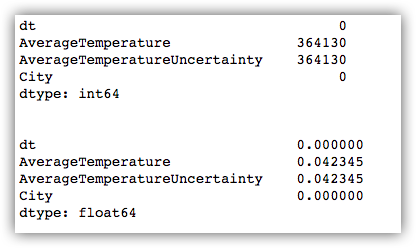

#### 删除操作

```python
# 原始模样
print(data.head())
print('\n')

# 默认参数axis=0，根据索引(index)删除指定的行，删除第0行数据
print(data.drop(0).head())
print('\n')

# axis=1,根据列名(columns)删除指定的列，删除'dt'列
print(data.drop('dt',axis=1).head())
print('\n')

# 移除含有缺失值的行，直接结果作为新df
data.dropna(axis=0, inplace=True)
```

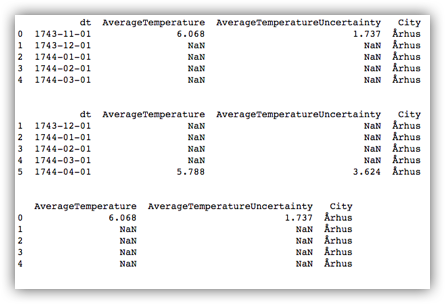


## Tip5：怎么把被错误填充的缺失值还原？

上个小锦囊讲到我们可以对缺失值进行丢弃处理，但是这种操作往往会丢失了很多信息的，很多时候我们都需要先看看缺失的原因，如果有些缺失是正常存在的，我们就不需要进行丢弃，保留着对我们的模型其实帮助会更大的。

此外，还有一种情况就是我们直接进行统计，它是没有缺失的，但是实际上是缺失的，什么意思？就是说缺失被人为（系统）地进行了填充，比如我们常见的用0、-9、-999、blank等来进行填充缺失，若真遇见这种情况，我们可以这么处理呢？

很简单，那就是**还原缺失！**

#### 单个操作

```python
# 引入数据集(皮马印第安人糖尿病预测数据集)
pima_columns = ['times_pregment','plasma_glucose_concentration','diastolic_blood_pressure','triceps_thickness',
                'serum_insulin','bmi','pedigree_function','age','onset_disbetes']

pima = pd.read_csv('./data/pima.data', names=pima_columns)


# 处理被错误填充的缺失值0，还原为 空(单独处理)
pima['serum_insulin'] = pima['serum_insulin'].map(lambda x:x if x !=0 else None)
# 检查变量缺失情况
pima['serum_insulin'].isnull().sum()

# Output：374
```


#### 批量操作

```python
# 批量操作 还原缺失值
columns = ['serum_insulin','bmi','plasma_glucose_concentration','diastolic_blood_pressure','triceps_thickness']

for col in columns:
    pima[col].replace([0], [None], inplace=True)

# 检查变量缺失情况
pima.isnull().sum()
```

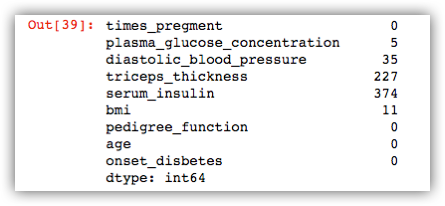


## Tip6：怎么定义一个方法去填充分类变量的空值？

之前我们说过如何删除掉缺失的行，但是如何我们需要的是填充呢？比如说用众数来填充缺失，或者用某个特定值来填充缺失值？这个也是我们需要掌握的特征工程的方法之一，对于用特定值填充缺失，其实比较简单了，我们可以直接用`fillna()` 方法就可以，下面我来讲一个通用的办法，除了用特定值填充，我们还可以自定义，比如说用”众数“来填充等等。

这里我们用到了`TransformerMixin`方法，然后自定义一个填充器来进行缺失值的填充。

这里我们造一个数据集来测试我们的代码：

```python
# 本次案例使用的数据集
import pandas as pd
X = pd.DataFrame({'city':['tokyo',None,'london','seattle','san fancisco','tokyo'],
                  'boolean':['y','n',None,'n','n','y'],
                  'ordinal_column':['somewhat like','like','somewhat like','like','somewhat like','dislike'],
                  'quantitative_column':[1,11,-.5,10,None,20]})
X
```

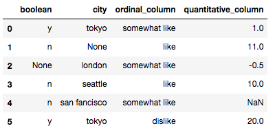


可以看出，这个数据集有三个分类变量，分别是boolean、city和ordinal_column，而这里面有两个字段存在空值。


```python
# 填充分类变量（基于TransformerMixin的自定义填充器，用众数填充）
from sklearn.base import TransformerMixin
class CustomCategoryzImputer(TransformerMixin):
    def __init__(self, cols=None):
        self.cols = cols
        
    def transform(self, df):
        X = df.copy()
        for col in self.cols:
            X[col].fillna(X[col].value_counts().index[0], inplace=True)
        return X
    
    def fit(self, *_):
        return self   
    
# 调用自定义的填充器
cci = CustomCategoryzImputer(cols=['city','boolean'])
cci.fit_transform(X)
```

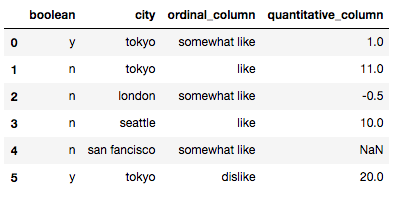


## Tip7：怎么定义一个方法去填充数值变量的空值？

这个锦囊和上一个差不多了，不过这个换一个方法 `Imputer` 。

同样的，我们还是造一个数据集：

```python
# 本次案例使用的数据集
import pandas as pd
X = pd.DataFrame({'city':['tokyo',None,'london','seattle','san fancisco','tokyo'],
                  'boolean':['y','n',None,'n','n','y'],
                  'ordinal_column':['somewhat like','like','somewhat like','like','somewhat like','dislike'],
                  'quantitative_column':[1,11,-.5,10,None,20]})
X
```


可以看出，这个数据集有一个数值变量`quantitative_columns`，存在一行缺失值，我们直接调用`sklearn`的`preprocessing`方法里的`Imputer`。

```python
# 填充数值变量（基于Imputer的自定义填充器，用众数填充）
from sklearn.preprocessing import Imputer
class CustomQuantitativeImputer(TransformerMixin):
    def __init__(self, cols=None, strategy='mean'):
        self.cols = cols
        self.strategy = strategy
        
    def transform(self, df):
        X = df.copy()
        impute = Imputer(strategy=self.strategy)
        for col in self.cols:
            X[col] = impute.fit_transform(X[[col]])
        return X
    
    def fit(self, *_):
        return self
    
# 调用自定义的填充器
cqi = CustomQuantitativeImputer(cols = ['quantitative_column'], strategy='mean')
cqi.fit_transform(X)
```

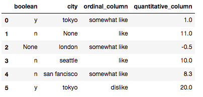


## Tip8：怎么把几个图表一起在同一张图上显示？

未来几个特征锦囊的内容会使用泰坦尼克号的数据集，大家可以在下面的链接去下载数据哈。

Titanic数据集下载：https://www.kaggle.com/c/titanic/data


首先我们要知道，做特征工程之前知道数据的分布和关联情况是极为重要的，因此把这些信息做一些可视化的操作是很重要的操作和技能，今天我们就来学习下怎么画很多张图，然后可以一并显示在同一张上吧，专业来说就是画子图。

#### 导入数据集

```python
# 导入相关库
import pandas as pd 
import numpy as np 
from pandas import Series,DataFrame

# 导入泰坦尼的数据集
data_train = pd.read_csv("./data/titanic/Train.csv")
data_train.head()
```

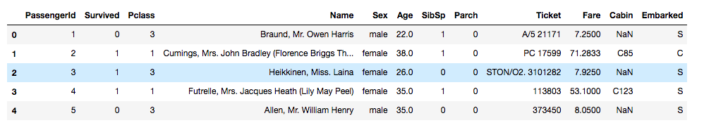


#### 代码汇集

```python
import matplotlib.pyplot as plt

# 设置figure_size尺寸
plt.rcParams['figure.figsize'] = (8.0, 6.0) 

fig = plt.figure()

# 设定图表颜色
fig.set(alpha=0.2)  

# 第一张小图
plt.subplot2grid((2,3),(0,0))           
data_train['Survived'].value_counts().plot(kind='bar')
plt.ylabel(u"人数")  
plt.title(u"船员获救情况 (1为获救)")

# 第二张小图
plt.subplot2grid((2,3),(0,1))
data_train['Pclass'].value_counts().plot(kind="bar")
plt.ylabel(u"人数")
plt.title(u"乘客等级分布")

# 第三张小图
plt.subplot2grid((2,3),(0,2))
plt.scatter(data_train['Survived'], data_train['Age'])
plt.ylabel(u"年龄") 
plt.grid(b=True, which='major', axis='y') 
plt.title(u"按年龄看获救分布 (1为获救)")

# 第四张小图，分布图
plt.subplot2grid((2,3),(1,0), colspan=2)
data_train.Age[data_train.Pclass == 1].plot(kind='kde')   
data_train.Age[data_train.Pclass == 2].plot(kind='kde')
data_train.Age[data_train.Pclass == 3].plot(kind='kde')
plt.xlabel(u"年龄")
plt.ylabel(u"密度") 
plt.title(u"各等级的乘客年龄分布")
plt.legend((u'头等舱', u'2等舱',u'3等舱'),loc='best')

# 第五张小图
plt.subplot2grid((2,3),(1,2))
data_train.Embarked.value_counts().plot(kind='bar')
plt.title(u"各登船口岸上船人数")
plt.ylabel(u"人数")  
plt.show()
```

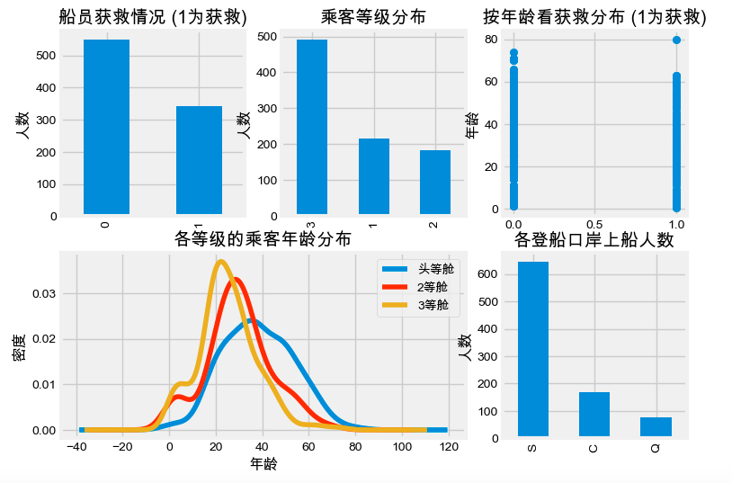

我们从上面的可视化操作结果可以看出，其实可以看出一些规律，比如说生还的几率比死亡的要大，然后获救的人在年龄上区别不大，然后就是有钱人（坐头等舱的）的年龄会偏大等。


## Tip9：怎么把画出堆积图来看占比关系？

未来几个特征锦囊的内容会使用泰坦尼克号的数据集，大家可以在下面的链接去下载数据哈。

Titanic数据集下载：https://www.kaggle.com/c/titanic/data


上次的锦囊我知道了怎么把几张图放在一张图上去显示，但是这个只是一种排版方式的操作，今天分享一个画堆积图的方法，可以用来看类别占比关系，有助于我们去了解数据，发现数据里的规律。

#### 导入数据集

```python
# 导入相关库
import pandas as pd 
import numpy as np 
from pandas import Series,DataFrame

# 导入泰坦尼的数据集
data_train = pd.read_csv("./data/titanic/Train.csv")
data_train.head()
```


#### 代码汇集

```python
# 设置figure_size尺寸
plt.rcParams['figure.figsize'] = (5.0, 4.0) 

#看看各乘客等级的获救情况
fig = plt.figure()
fig.set(alpha=0.8)

Survived_0 = data_train.Pclass[data_train.Survived == 0].value_counts()
Survived_1 = data_train.Pclass[data_train.Survived == 1].value_counts()
df=pd.DataFrame({u'获救':Survived_1, u'未获救':Survived_0})
df.plot(kind='bar', stacked=True)
plt.title(u"各乘客等级的获救情况")
plt.xlabel(u"乘客等级") 
plt.ylabel(u"人数") 
plt.show()
```

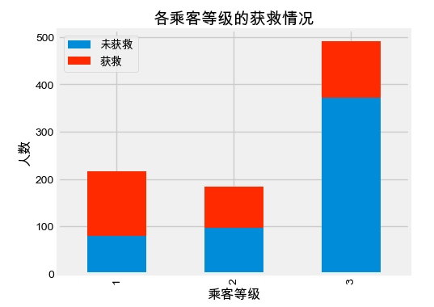


## Tip10：怎么对满足某种条件的变量修改其变量值？

未来几个特征锦囊的内容会使用泰坦尼克号的数据集，大家可以在下面的链接去下载数据哈。

Titanic数据集下载：

https://www.kaggle.com/c/titanic/data


这里我们使用`loc`函数，这个方式实在是太好用了！

首先我们先理解一下这个`loc`应该怎么用吧，然后再举几个实战例子来理解一下。

我们要知道loc函数的意思就是通过行标签索引行数据，最直接的就是看看文档，引用文档里的数据集：

```python
df = pd.DataFrame([[1, 2], [4, 5], [7, 8]],index=['cobra', 'viper', 'sidewinder'],columns=['max_speed', 'shield'])
df
```

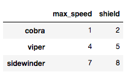

下面的小例子就是从文档里拿过来的，很全面的示例了一些应用操作。

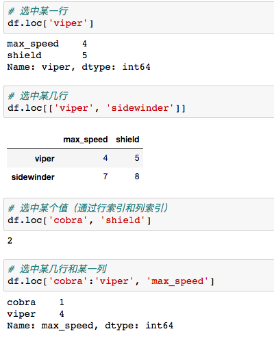

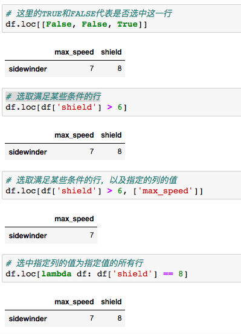

那么通过上面的学习，你大概也知道了`loc`的简单用法了，下面就介绍下在特征工程里我们清洗某些数据时候，可以通过这函数来修改变量值，从而达到我们的某些目的。


下面我们还是用泰坦尼号的数据集：

```python
# 导入相关库
import pandas as pd 
import numpy as np 
from pandas import Series,DataFrame

# 导入泰坦尼的数据集
data_train = pd.read_csv("./data/titanic/Train.csv")
data_train['Age'].value_counts().sort_index()
```

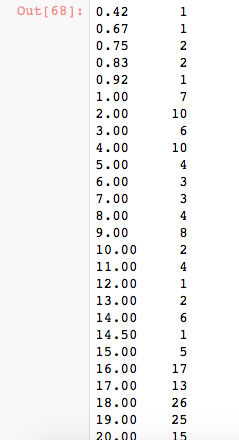

我们可以看出有些年龄有小于1岁的，比如0.42、0.67之类的，我们这里就使用一下`loc`来把这些小于1岁的修改为1岁吧，如果没有意外，应该岁数为1的统计数会变为14个。

```python
data_train.loc[(data_train.Age<=1),'Age'] = 1
data_train['Age'].value_counts().sort_index()
```

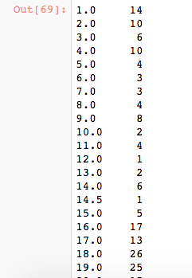


## Tip11：怎么通过正则提取字符串里的指定内容?

这个正则表达式在我们做字符提取中是十分常用的，先前有一篇文章有介绍到怎么去使用正则表达式来实现我们的目的，大家可以先回顾下这篇文章。

[图文并茂地带你入门正则表达式](https://mp.weixin.qq.com/s/F63qWLEWZY6vHGUK3pjnfA)


我们还是用一下泰坦尼克号的数据集，大家可以在下面的链接去下载数据哈。

Titanic数据集下载：

https://www.kaggle.com/c/titanic/data

```python
# 导入相关库
import pandas as pd 
import numpy as np 
from pandas import Series,DataFrame
import re

# 导入泰坦尼的数据集
data_train = pd.read_csv("./data/titanic/Train.csv")
data_train.head()
```

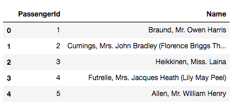

我们现在可以提取下这`name`里的称谓，比如Mr、Miss之类的，作为一个新列，代码如下:

```python
data['Title'] = data['Name'].map(lambda x: re.compile(", (.*?)\.").findall(x)[0])
data.head()
```

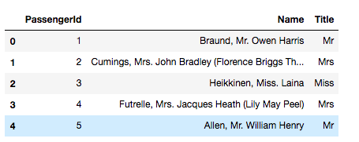


我们之前看这代码其实有点懵的，不过这是因为大家可能对正则表达式的规则不太熟悉，所以下面有几个相关的可以参考下。

```python
import re
str = 'xxdaxxabxxacabxxcdabddbxxssbdffbggxx'
# 一个'.'就是匹配\n(换行符)以外的任何字符
print(re.findall(r'a.b',str))

# 一个'*'前面的字符出现0次或以上
print(re.findall(r'a*b',str))

# 匹配从.*前面的字符为起点，到后面字符为终点的所有内容，直到返回所有
print(re.findall(r'xx.*xx',str))

# 非贪婪，和上面的一样，不过是用过一次就不会再用,，以列表的形式返回
print(re.findall(r'xx.*?xx',str))

# 非贪婪，与上面是一样的，只是与上面相比，多了一个括号，只保留括号中的内容
print(re.findall(r'xx(.*?)xx',str))

# 保留a,b中间的内容
print(re.findall(r'xx(.+?)xx',str))
print(re.findall(r'xx(.+?)xx',str)[0])
```

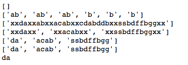


所以，看了这些后，应该就可以理解上面的pattern的含义了！


## Tip12：如何利用字典批量修改变量值？

这里我们假设有这么一种情况，一个字段里的变量值，需要把某几个变量值修改为同一个值，然后其他几个变量值修改为另外一个，那么我们有什么简单的办法可以完成呢？这边，我推荐一个**字典映射**的办法！

我们还是用一下泰坦尼克号的数据集，大家可以在下面的链接去下载数据哈。

Titanic数据集下载：

https://www.kaggle.com/c/titanic/data

```python
# 导入相关库
import pandas as pd 
import numpy as np 
from pandas import Series,DataFrame
import re

# 导入泰坦尼的数据集
data_train = pd.read_csv("./data/titanic/Train.csv")
# 提取其中几列
data = data_train.loc[:,['PassengerId','Name']]

# 提取称谓
data['Title'] = data['Name'].map(lambda x: re.compile(", (.*?)\.").findall(x)[0])
data.Title.value_counts()
```

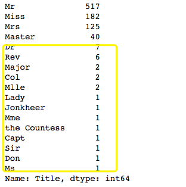

就好像我刚刚所说的，需要把黄色框框里的变量值修改掉，而且是按照我们的想法，比如`capt`和`Dr`合为一体，统一叫`officer`。

```python
# 定义一个空字典来收集映射关系
title_Dict = {}
title_Dict.update(dict.fromkeys(['Capt', 'Col', 'Major', 'Dr', 'Rev'], 'Officer'))
title_Dict.update(dict.fromkeys(['Don', 'Sir', 'the Countess', 'Dona', 'Lady'], 'Royalty'))
title_Dict.update(dict.fromkeys(['Mme', 'Ms', 'Mrs'], 'Mrs'))
title_Dict.update(dict.fromkeys(['Mlle', 'Miss'], 'Miss'))
title_Dict.update(dict.fromkeys(['Mr'], 'Mr'))
title_Dict.update(dict.fromkeys(['Master','Jonkheer'], 'Master'))
title_Dict
```

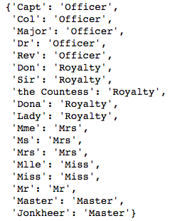

我们把映射关系用字典来存储，到时候直接可以拿来用。

```python
data['Title'] = data['Title'].map(title_Dict)
data.Title.value_counts()
```

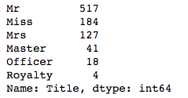


## Tip13：如何对类别变量进行独热编码？

很多时候我们需要对类别变量进行独热编码，然后才可以作为入参给模型使用，独热的方式有很多种，这里介绍一个常用的方法 `get_dummies`吧，这个方法可以让类别变量按照枚举值生成N个（N为枚举值数量）新字段，都是0-1的变量值。

我们还是用到我们的泰坦尼克号的数据集，同时使用我们上次锦囊分享的知识，对数据进行预处理操作，见下：

```python
# 导入相关库
import pandas as pd 
import numpy as np 
from pandas import Series,DataFrame
import re

# 导入泰坦尼的数据集
data_train = pd.read_csv("./data/titanic/Train.csv")
# 提取其中几列
data = data_train.loc[:,['PassengerId','Name']]

# 提取称谓
data['Title'] = data['Name'].map(lambda x: re.compile(", (.*?)\.").findall(x)[0])

# 定义一个空字典来收集映射关系
title_Dict = {}
title_Dict.update(dict.fromkeys(['Capt', 'Col', 'Major', 'Dr', 'Rev'], 'Officer'))
title_Dict.update(dict.fromkeys(['Don', 'Sir', 'the Countess', 'Dona', 'Lady'], 'Royalty'))
title_Dict.update(dict.fromkeys(['Mme', 'Ms', 'Mrs'], 'Mrs'))
title_Dict.update(dict.fromkeys(['Mlle', 'Miss'], 'Miss'))
title_Dict.update(dict.fromkeys(['Mr'], 'Mr'))
title_Dict.update(dict.fromkeys(['Master','Jonkheer'], 'Master'))
data['Title'] = data['Title'].map(title_Dict)
data.Title.value_counts()
```

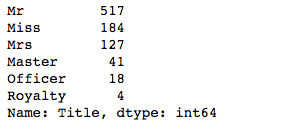

那么接下来我们对字段Title进行独热编码，这里使用get_dummies，生成N个0-1新字段：

```python
# 我们对字段Title进行独热编码，这里使用get_dummies，生成N个0-1新字段
dummies_title = pd.get_dummies(data['Title'], prefix="Title")
data = pd.concat([data,dummies_title], axis=1)
data.head()
```

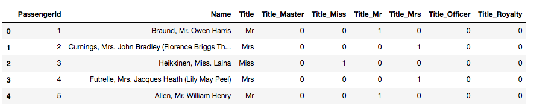

对了，这里有些同学可能会问，还有一种独热编码出来的是N-1个字段的又是什么？另外这种的话，我们是称为`dummy encoding`的，也就是哑变量编码，它把任意一个状态位去除，也就是说其中有一类变量值的哑变量表示为全0。更多的内容建议可以百度深入了解哈。


## Tip14：如何把“年龄”字段按照我们的阈值分段？

我们在进行特征处理的时候，也有的时候会遇到一些变量，比如说年龄，然后我们想要按照我们想要的阈值进行分类，比如说低于18岁的作为一类，18-30岁的作为一类，那么怎么用Python实现的呢？

是的，我们还是用到我们的泰坦尼克号的数据集，对数据进行预处理操作，见下：

```python
# 导入相关库
import pandas as pd 
import numpy as np 
from pandas import Series,DataFrame

# 导入泰坦尼的数据集
data_train = pd.read_csv("./data/titanic/Train.csv")
# 修复部分age的值
data_train.loc[(data_train.Age<=1),'Age'] = 1
# 只保留部分值
data = data_train.loc[:,['PassengerId','Age']]
data.head()
```

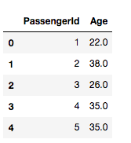

然后，我们编辑代码，按照我们的预期进行分组:

```python
# 确定阈值，写入列表
bins = [0, 12, 18, 30, 50, 70, 100]
data['Age_group'] = pd.cut(data['Age'], bins)

dummies_Age = pd.get_dummies(data['Age_group'], prefix= 'Age')
data = pd.concat([data, dummies_Age], axis=1)

data.head()
```

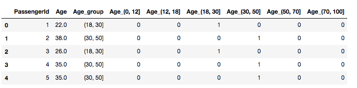


这样子就很神奇了吧，把年龄按照我们的需求进行分组，顺便使用独热编码生成了新的字段。


## Tip15：如何使用sklearn的多项式来衍生更多的变量？

关于这种衍生变量的方式，理论其实大家应该很早也都听说过了，但是如何在Python里实现，也就是今天在这里分享给大家，其实也很简单，就是调用`sklearn`的`PolynomialFeatures`方法，具体大家可以看看下面的demo。


这里使用一个人体加速度数据集，也就是记录一个人在做不同动作时候，在不同方向上的加速度，分别有3个方向，命名为x、y、z。

```python
# 人体胸部加速度数据集,标签activity的数值为1-7
'''
1-在电脑前工作
2-站立、走路和上下楼梯
3-站立
4-走路
5-上下楼梯
6-与人边走边聊
7-站立着说话

'''
import pandas as pd
df = pd.read_csv('./data/activity_recognizer/1.csv', header=None)
df.columns = ['index','x','y','z','activity']
df.head()

```

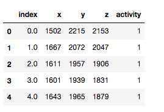

那么我们可以直接调用刚刚说的办法，然后对于数值型变量多项式的变量扩展，代码如下:

```python
# 扩展数值特征
from sklearn.preprocessing import PolynomialFeatures

x = df[['x','y','z']]
y = df['activity']

poly = PolynomialFeatures(degree=2, include_bias=False, interaction_only=False)

x_poly = poly.fit_transform(x)
pd.DataFrame(x_poly, columns=poly.get_feature_names()).head()
```

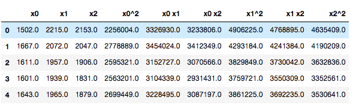


## Tip16：如何根据变量相关性画出热力图？

上次的锦囊有提及到如何使用`sklearn`来实现多项式的扩展来衍生更多的变量，但是我们也知道其实这样子出来的变量之间的相关性是很强的，我们怎么可以可视化一下呢？这里介绍一个热力图的方式，调用`corr`来实现变量相关性的计算，同时热力图，颜色越深的话，代表相关性越强！

```python
# 人体胸部加速度数据集,标签activity的数值为1-7
'''
1-在电脑前工作
2-站立、走路和上下楼梯
3-站立
4-走路
5-上下楼梯
6-与人边走边聊
7-站立着说话

'''
import pandas as pd
from sklearn.preprocessing import PolynomialFeatures

df = pd.read_csv('./data/activity_recognizer/1.csv', header=None)
df.columns = ['index','x','y','z','activity']

x = df[['x','y','z']]
y = df['activity']

# 多项式扩充数值变量
poly = PolynomialFeatures(degree=2, include_bias=False, interaction_only=False)

x_poly = poly.fit_transform(x)
pd.DataFrame(x_poly, columns=poly.get_feature_names()).head()

# 查看热力图(颜色越深代表相关性越强)
%matplotlib inline
import seaborn as sns

sns.heatmap(pd.DataFrame(x_poly, columns=poly.get_feature_names()).corr())
```

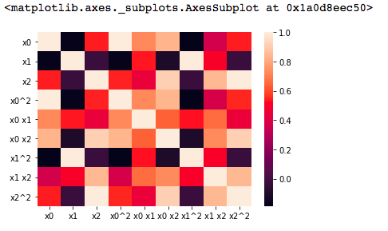


## Tip17：如何把分布修正为类正态分布？

今天我们用的是一个新的数据集，也是在kaggle上的一个比赛，大家可以先去下载一下：


下载地址：https://www.kaggle.com/c/house-prices-advanced-regression-techniques/data

```python
import pandas as pd
import numpy as np
# Plots
import seaborn as sns
import matplotlib.pyplot as plt

# 读取数据集
train = pd.read_csv('./data/house-prices-advanced-regression-techniques/train.csv')
train.head()

```

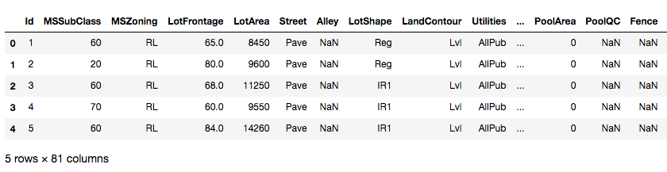


首先这个是一个价格预测的题目，在开始前我们需要看看分布情况，可以调用以下的方法来进行绘制：

```python
sns.set_style("white")
sns.set_color_codes(palette='deep')
f, ax = plt.subplots(figsize=(8, 7))
#Check the new distribution 
sns.distplot(train['SalePrice'], color="b");
ax.xaxis.grid(False)
ax.set(ylabel="Frequency")
ax.set(xlabel="SalePrice")
ax.set(title="SalePrice distribution")
sns.despine(trim=True, left=True)
plt.show()

```

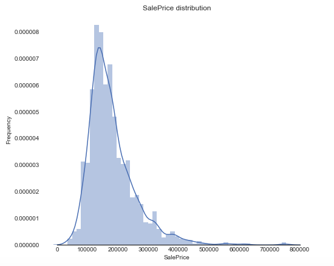


我们从结果可以看出，销售价格是右偏，而大多数机器学习模型都不能很好地处理非正态分布数据，所以我们可以应用log(1+x)转换来进行修正。那么具体我们可以怎么用Python代码实现呢？

```python
# log(1+x) 转换
train["SalePrice_log"] = np.log1p(train["SalePrice"])

sns.set_style("white")
sns.set_color_codes(palette='deep')
f, ax = plt.subplots(figsize=(8, 7))

sns.distplot(train['SalePrice_log'] , fit=norm, color="b");

# 得到正态分布的参数
(mu, sigma) = norm.fit(train['SalePrice_log'])

plt.legend(['Normal dist. ($\mu=$ {:.2f} and $\sigma=$ {:.2f} )'.format(mu, sigma)],
            loc='best')
ax.xaxis.grid(False)
ax.set(ylabel="Frequency")
ax.set(xlabel="SalePrice")
ax.set(title="SalePrice distribution")
sns.despine(trim=True, left=True)

plt.show()
```

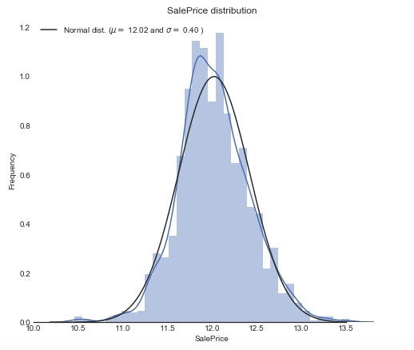


## Tip18：怎么找出数据集中有数据倾斜的特征？

今天我们用的是一个新的数据集，也是在kaggle上的一个比赛，大家可以先去下载一下：


下载地址：https://www.kaggle.com/c/house-prices-advanced-regression-techniques/data

```python
import pandas as pd
import numpy as np
# Plots
import seaborn as sns
import matplotlib.pyplot as plt

# 读取数据集
train = pd.read_csv('./data/house-prices-advanced-regression-techniques/train.csv')
train.head()
```


我们对数据集进行分析，首先我们可以先看看特征的分布情况，看下哪些特征明显就是有数据倾斜的，然后可以找办法解决，因此，第一步就是要有办法找到这些特征。

首先可以通过可视化的方式，画箱体图，然后观察箱体情况，理论知识是：

> 在箱线图中，箱子的中间有一条线，代表了数据的中位数。箱子的上下底，分别是数据的上四分位数（Q3）和下四分位数（Q1），这意味着箱体包含了50%的数据。因此，**箱子的高度在一定程度上反映了数据的波动程度**。上下边缘则代表了该组数据的最大值和最小值。有时候箱子外部会有一些点，可以理解为数据中的“**异常值**”。而对于数据倾斜的，我们叫做“偏态”，与正态分布相对，指的是非对称分布的偏斜状态。在统计学上，众数和平均数之差可作为分配偏态的指标之一：如平均数大于众数，称为正偏态（或右偏态）；相反，则称为负偏态（或左偏态）。


```python
# 丢弃y值
all_features = train.drop(['SalePrice'], axis=1)

# 找出所有的数值型变量
numeric_dtypes = ['int16', 'int32', 'int64', 'float16', 'float32', 'float64']
numeric = []
for i in all_features.columns:
    if all_features[i].dtype in numeric_dtypes:
        numeric.append(i)
        
# 对所有的数值型变量绘制箱体图
sns.set_style("white")
f, ax = plt.subplots(figsize=(8, 7))
ax.set_xscale("log")
ax = sns.boxplot(data=all_features[numeric] , orient="h", palette="Set1")
ax.xaxis.grid(False)
ax.set(ylabel="Feature names")
ax.set(xlabel="Numeric values")
ax.set(title="Numeric Distribution of Features")
sns.despine(trim=True, left=True)
```

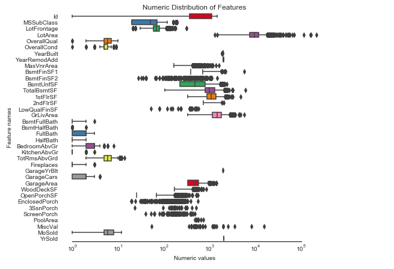

可以看出有一些特征，有一些数据会偏离箱体外，因此属于数据倾斜。但是，我们从上面的可视化中虽然看出来了，但是想要选出来还是比较麻烦，所以这里引入一个偏态的概念，相对应的有一个指标`skew`，这个就是代表偏态的系数。

> Skewness：描述数据分布形态的统计量，其描述的是某总体取值分布的**对称性**，简单来说就是数据的不对称程度。
>
> 偏度是三阶中心距计算出来的。
>
> （1）Skewness = 0 ，分布形态与正态分布偏度相同。
>
> （2）Skewness > 0 ，正偏差数值较大，为正偏或右偏。长尾巴拖在右边，数据右端有较多的极端值。
>
> （3）Skewness < 0 ，负偏差数值较大，为负偏或左偏。长尾巴拖在左边，数据左端有较多的极端值。
>
> （4）数值的绝对值越大，表明数据分布越不对称，偏斜程度大。

那么在Python里可以怎么实现呢？

```python
# 找出明显偏态的数值型变量
skew_features = all_features[numeric].apply(lambda x: skew(x)).sort_values(ascending=False)

high_skew = skew_features[skew_features > 0.5]
skew_index = high_skew.index

print("本数据集中有 {} 个数值型变量的 Skew > 0.5 :".format(high_skew.shape[0]))
skewness = pd.DataFrame({'Skew' :high_skew})
skew_features.head(10)
```

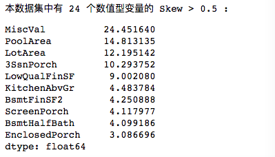


## Tip19：怎么尽可能地修正数据倾斜的特征？

上一个锦囊，分享了给大家通过`skew`的方法来找到数据集中有数据倾斜的特征（特征锦囊：怎么找出数据集中有数据倾斜的特征？），那么怎么去修正它呢？正是今天要分享给大家的锦囊！


还是用到房价预测的数据集：


下载地址：https://www.kaggle.com/c/house-prices-advanced-regression-techniques/data

```python
import pandas as pd
import numpy as np
# Plots
import seaborn as sns
import matplotlib.pyplot as plt

# 读取数据集
train = pd.read_csv('./data/house-prices-advanced-regression-techniques/train.csv')
train.head()
```


我们通过上次的知识，知道了可以通过`skewness`来进行倾斜特征的辨别，那么对于修正它的办法，这里也先分享一个理论知识 —— **box-cox转换**。

> 线性回归模型满足线性性、独立性、方差齐性以及正态性的同时，又不丢失信息，此种变换称之为Box—Cox变换。
>
> Box-Cox变换是Box和Cox在1964年提出的一种广义幂变换方法，是统计建模中常用的一种[数据](https://baike.baidu.com/item/数据/33305)变换，用于连续的响应变量不满足正态分布的情况。Box-Cox变换之后，可以一定程度上减小不可观测的误差和预测变量的相关性。Box-Cox变换的主要特点是引入一个参数，通过数据本身估计该参数进而确定应采取的数据变换形式，Box-Cox变换可以明显地改善数据的正态性、对称性和方差相等性，对许多实际数据都是行之有效的。—— 百度百科


在使用前，我们先看看原先倾斜的特征有多少个。


```python
# 丢弃y值
all_features = train.drop(['SalePrice'], axis=1)

# 找出所有的数值型变量
numeric_dtypes = ['int16', 'int32', 'int64', 'float16', 'float32', 'float64']
numeric = []
for i in all_features.columns:
    if all_features[i].dtype in numeric_dtypes:
        numeric.append(i)
        
# 找出明显偏态的数值型变量
skew_features = all_features[numeric].apply(lambda x: skew(x)).sort_values(ascending=False)

high_skew = skew_features[skew_features > 0.5]
skew_index = high_skew.index

print("本数据集中有 {} 个数值型变量的 Skew > 0.5 :".format(high_skew.shape[0]))
skewness = pd.DataFrame({'Skew' :high_skew})
skew_features
```

> 本数据集中有 24 个数值型变量的 Skew > 0.5 :


在Python中怎么使用Box-Cox 转换呢？很简单。

```python
# 通过 Box-Cox 转换，从而把倾斜的数据进行修正
for i in skew_index:
    all_features[i] = boxcox1p(all_features[i], boxcox_normmax(all_features[i] + 1))
```


然后我们再看看还有多少个数据倾斜的特征吧！

```python
# 找出明显偏态的数值型变量
skew_features = all_features[numeric].apply(lambda x: skew(x)).sort_values(ascending=False)

high_skew = skew_features[skew_features > 0.5]
skew_index = high_skew.index
print("本数据集中有 {} 个数值型变量的 Skew > 0.5 :".format(high_skew.shape[0]))
skewness = pd.DataFrame({'Skew' :high_skew})
```

> 本数据集中有 15 个数值型变量的 Skew > 0.5 :


变少了很多，而且如果看他们的skew值，也会发现变小了很多。我们也可以看看转换后的箱体图情况。

```python
# Let's make sure we handled all the skewed values
sns.set_style("white")
f, ax = plt.subplots(figsize=(8, 7))
ax.set_xscale("log")
ax = sns.boxplot(data=all_features[skew_index] , orient="h", palette="Set1")
ax.xaxis.grid(False)
ax.set(ylabel="Feature names")
ax.set(xlabel="Numeric values")
ax.set(title="Numeric Distribution of Features")
sns.despine(trim=True, left=True)
```

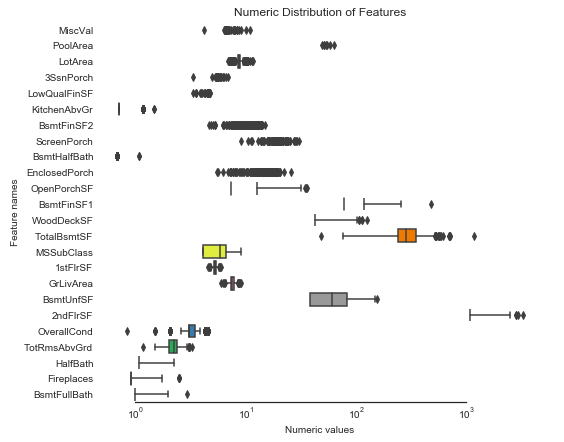


最新的发布内容请关注个人微信公众号哈~

